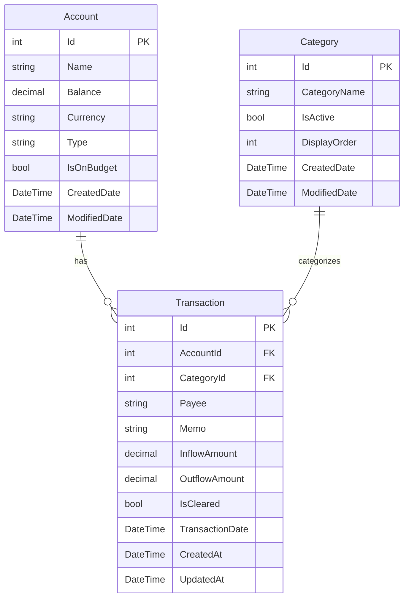

# FortunaPrimigenia

FortunaPrimigenia is a professional budget tracking application built with **ASP.NET Core 10.0**. It provides a robust API to manage accounts, categories, and transactions, enabling users to track their financial health efficiently.

## 🚀 Features

- **Account Management**: Track different bank accounts and their balances.
- **Transaction Tracking**: Categorize income and expenses.
- **Data Seeding**: Comes with predefined categories and initial data for quick start.
- **Modern API**: Built with C# 14 and the latest .NET features.
- **Interactive API Documentation**: Integrated with Scalar for a beautiful API reference.

## 🛠️ Technologies Used

- **Backend**: ASP.NET Core 10.0 (MVC/Web API)
- **Language**: C# 14.0
- **Database**: SQLite with Entity Framework Core
- **Documentation**: OpenAPI and Scalar
- **Testing**: xUnit, Moq, and Integration Testing projects

## 📂 Project Structure

The solution is organized into several projects to ensure separation of concerns:

- `FortunaPrimigenia.Api`: The main Web API project containing controllers, models, services, and repositories.
  - `Controllers`: Handles HTTP requests and interacts with services.
  - `Services`: Contains business logic.
  - `Repositories`: Manages data access using Entity Framework Core.
  - `Models/Domain`: Core entity models (Account, Category, Transaction).
  - `Models/DTO`: Data Transfer Objects for API requests and responses.
  - `Data`: DB Context and data seeding logic.
- `FortunaPrimigenia.Api.Tests.Unit`: Unit tests for services and controllers.
- `FortunaPrimigenia.APi.Tests.Integration`: Integration tests for the API endpoints, including `.http` files for quick testing.

## 🚦 Getting Started

### Prerequisites

- [.NET 10.0 SDK](https://dotnet.microsoft.com/download/dotnet/10.0)
- An IDE (Rider, Visual Studio, or VS Code)

### Running the Application

1. **Clone the repository**:
   ```bash
   git clone <repository-url>
   cd FortunaPrimigenia
   ```

2. **Restore dependencies**:
   ```bash
   dotnet restore
   ```

3. **Run the API project**:
   ```bash
   dotnet run --project FortunaPrimigenia.Api
   ```

The application will start, and the SQLite database (`db.sqlite`) will be automatically created and seeded if it doesn't exist.

## 📊 Domain Model (ERD)

The following diagram illustrates the relationship between the core domain entities:



## 🔌 API Endpoints

Below is a summary of the main API endpoints available in the application.

### Accounts
- `GET /Accounts`: Retrieve all accounts.
- `GET /Accounts/{accountId}`: Get a specific account by ID.
- `GET /Accounts/name/{accountName}`: Get an account by its name.
- `POST /Accounts`: Create a new account.
- `PUT /Accounts/{accountId}`: Update an existing account.
- `DELETE /Accounts/{accountId}`: Delete an account.

### Transactions
- `GET /Transactions/{transactionId}`: Get a specific transaction by ID.
- `GET /Transactions/account/{accountId}`: Get all transactions for a specific account.
- `GET /Transactions/account/{accountId}/count`: Get the total count of transactions for an account.
- `POST /Transactions`: Create multiple transactions at once.
- `PUT /Transactions/{transactionId}`: Update a transaction.
- `DELETE /Transactions/{transactionId}`: Delete a transaction.

### Categories
- `CategoriesController` is available but currently does not define custom endpoints (inherits from `ControllerBase`).

## 📖 API Documentation

When running in **Development** mode, you can access the interactive API documentation:

- **Scalar API Reference**: `https://localhost:<port>/scalar/v1`
- **OpenAPI JSON**: `https://localhost:<port>/openapi/v1.json`

(Replace `<port>` with the actual port the app is running on, usually 5001 or 5000).

## 🧪 Testing

To run all tests in the solution:

```bash
dotnet test
```

You can also find `.http` files in `FortunaPrimigenia.APi.Tests.Integration` for manual endpoint testing via Rider's or VS Code's HTTP Client.

## 📝 License

This project is licensed under the [LICENSE](LICENSE) file included in the repository.
